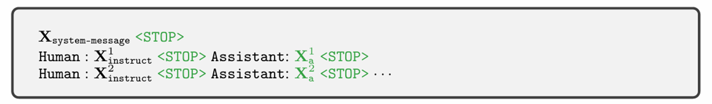

# BLIP-2: Bootstrapping Language-Image Pre-training with Frozen Image Encoders and Large Language Models

论文地址：https://arxiv.org/abs/2301.12597

机构：Salesforce Research

作者：Junnan Li, Dongxu Li Silvio Savarese, Steven Hoi

发布会议：ICML 2023

面向任务：**视觉语言模型预训练方法**，可以解决VQA、Image Captioning、Image-Text Retrieval等多种任务

## 动机

视觉语言预训练模型为各种下游任务提供一个基础模型，并且在零样本迁移上表现出色。 

过去很多工作使用大量图片文本对数据集对模型进行**端到端**训练（VL-BERT、Unicoder-VL、OSCAR、ViLBERT等），这种方式随着模型的不断增大，所需要的计算资源也不断变大。而且无法利用视觉领域和文本领域已有的单模态预训练大模型。 

本文的方法**冻结预训练的视觉模型和语言模型**，预训练的过程只调节连接视觉模型和语言模型的模块（Q-Former），从而大大减少可训练的参数数量（比Flamingo80B少54倍的参数数量）。

这种方法的核心挑战在于对齐视觉特征和语言特征。相关工作有Frozen（微调视觉模型，将视觉模型的特征作为语言模型的soft prompts）、Flamingo（在LLM中插入cross-attention层， 注入视觉特征）。这些工作都使用text conditioned language modeling loss进行预训练。

BLIP-2借鉴了BLIP，**使用多种loss进行预训练：ITM、ITC、ITG**。

## 方法

### 模型结构

BLIP-2的连接模块使用的是Querying Transformer（Q-Former）：

包括一个**Image Transformer**（左侧）和**Text Transformer**（右侧）。Image Transformer和Text Transformer共享相同的Self Attention层。根据训练目标不同，采用不同的Attention Masking控制Query 和Text的交互。

Text Transformer既可以作为text encoder，也可以作为text decoder。

Image Transformer和视觉特征进行交互，将Queries作为参数，**查询出视觉特征中和文本最相关的视觉信息**。无论图片的分辨率多大，提取出固定数量的视觉信息。在文章的实验中，使用32 queries，每个query 768维，比图像257 * 1024（ViT-L/14）的特征小很多。

使用$$ BERT_{base} $$对Q-Former进行初始化，cross attention layer随机初始化。总共188M可训练参数。

### 模型训练

使用图像文本对数据集进行预训练，分为两个阶段：

- 阶段一：vision-language **representation learning** stage with a **frozen image encoder**
- 阶段二：vision-to-language **generative learning** stage with a **frozen LLM**

***阶段一：vision-language representation learning stage with a frozen image encoder***

**训练Q-Former，从视觉特征中导出和文本最相关的信息。使用三种预训练目标：ITC、ITG、ITM。**

- ITC（Image-Text Contrastive Learning）

  **使image representation和text representation的表示在向量空间对齐**。

  配对的图像和文本对相似度尽可能大，不配对的图像和文本对相似度尽可能小。

  采用Uni-modal Self-Attention Mask，query和text不能互相看到。

  相似度计算：每个query的输出向量和文本的[CLS]输出向量计算相似度，选取最高的作为图像和文本相似度。

  

- ITG（Image-grounded Text Generation）

  训练Q-Former在图片条件下生成文本。

  采用Multi-modal Causal Self-Attention Mask。queries之间可以相互看到，但不能看到文本。每个text token可以看到所有queries及其之前的text tokens。

  

  Text transformer无法直接和视觉编码器交互，生成文本需要的信息必须首先由queries从视觉特征中提取出。因此**queries被训练提取出生成文本需要的所有视觉信息**。

- ITM（Image-Text Matching）

  二分类任务，模型预测一个图片文本对是否匹配，**使图片和文本表示细粒度对齐**。

  采用Bi-directional Self-Attention Mask，queries和text tokens可以互相看到。

  

  把每个query的输出embedding送入一个二分类的线性分类头得到logit，将所 有query的logits相加作为最终的匹配分数。

***阶段二： vision-to-language generative learning stage with a frozen LLM***

训练Q-Former，**加入一个FC**和冻结的LLM连接，使用language modeling loss。

**将Q-Former导出的视觉信息使用LC映射到和LLM embedding层相同的dimension，这些信息作为soft visual prompts拼接到输入的text embeddings之前。**

**经过阶段一的训练，Q-Former学习了抽取最有用的视觉信息，进行了视觉表示和文本表示的对齐，减轻了第二阶段将视觉信息映射到LLM embedding空间的负担。**

尝试了两种LLM，decoder-based LLM：OPT和encoder-decoder-based LLM：FlanT5。

对于OPT，根据Q-Former的视觉信息和已生成的文本预测下一个token。对于FlanT5，将文本分为两部分，一部分和视觉信息拼接送给编码器，另一部分作为decoder的生成目标。

## 实验

### Zero-shot VQA

在VQAv2上，比Flamingo80B高8.7%，尽管比Flamingo80B少54倍的参数。

另外实验发现：更强大的image encoder和更强大的LLM都可以使实验结果变得更好。这一观察结果验证了BLIP-2是一种**通用的视觉语言预训练方法**，可以有效地利用各种先进的视觉预训练模型和先进的语言模型。

### Vision-Language Representation Learning 消融实验

当去掉第一阶段的pretraining时，两种类型的LLM在zero-shot VQA上的性能都大幅下降。对于OPT，产生灾难性遗忘，随着training的进行，性能下降。消融实验证明了第一阶段pretraining的重要性。

### Image Captioning

使用prompt：a photo of作为LLM的初始文本输入，**在COCO上微调Q-Former和image encoder**。当零样本迁移到NoCaps数据集上时，比之前的方法性能上有很大提升。证明了模型对于out-domain images的泛化能力。

### Visual Question Answering

**在VQA数据集上（VQAv2的训练集和验证集、 Visual Genome的训练集）微调Q-Former和image encoder的参数**，使用open-ended答案生成损失。

将问题也输入进Q-Former，从而指导Q-Former注意和问题更相关的图像区域。

在open-ended generation models中BLIP-2取得了SOTA的性能。

### Image-Text Retrieval

检索任务不涉及文本生成，因此**只使用第一阶段预训练的模型**。**在COCO数据集上使用第一阶段相同的3个训练目标进行微调**，测试COCO上的性能和Flickr30K上零样本的性能。

实验结果显示，相比于已有的方法，BLIP-2在零样本检索上性能有很大提升。

## 后续工作

在训练语言模型时，指令微调对于模型的性能至关重要。微调的指令集通常不需要太大，但是对质量要求很高。**后续很多工作聚焦于如何对大规模预训练的视觉语言模型进行指令微调。**

### LLaVA

论文地址：https://arxiv.org/abs/2304.08485

发布会议： NeurIPS 2023

冻结视觉模型和语言模型，通过一个简单的线性映射层进行连接视觉模型和语言模型。

视觉模型选用ViT-L/14，语言模型选用Vicuna。

将视觉模型的grid features经过一个线性映射层转换为一系列视觉token。

使用GPT-4，由图片文本对生成了**multimodal instruction-following data**，包括Conversation、Detailed description、Complex reasoning三类，总共158K个样本。

采用语言模型的损失，只有绿色的部分计算损失。

采用两个阶段的预训练：

- Stage 1: Pre-training for Feature Alignment (数据质量不高，仅训练线性映射层的参数)

- Stage 2: Fine-tuning End-to-End (数据质量高，训练映射层的参数和LLM的参数)

***Stage 1: Pre-training for Feature Alignment***

使用595K图片文本对，每个文本对是一个单轮的对话，随机采样一个让模型描述图片的问题，ground-truth是原始的caption。在训练时冻结视觉模型和语言模型，仅训练线性映射层的参数。这个阶段可以理解为**为LLM训练一个兼容的visual tokenizer**。

***Stage 2: Fine-tuning End-to-End***

冻结视觉模型的参数，使用构建的158K instruction-following data，对映射层的参数和LLM的参数进行更新。

手工设计了LLaVA-Bench (In-the-Wild)数据集，用来评测模型的Instruction-following能力，使用GPT4进行打分。

可以看到LLaVA比OpenFlamingo和BLIP-2表现好很多。

### InstructBLIP

论文地址：https://arxiv.org/abs/2305.06500

发布会议： NeurIPS 2024

**在BLIP-2的基础上进行指令微调**，**Q-Former除了接收Queries和Image Embeddings，还接收instruction text tokens**，**instruction和Query embeddings在self-attention层进行交互，指导Q-Former提取出instruction相关的视觉信息**。

使用模板的方式由多个数据集构造指令微调数据集，并使用了LLaVA-Instruct-150K数据集。

InstructBLIP在各个数据集上都比BLIP-2性能要好，证明了指令微调的有效性。

## 收获

通过BLIP-2、LLaVA和InstructBLIP这三篇文章，我了解了**如何利用已有的先进的视觉模型和语言模型训练一个视觉语言模型**。主要的挑战在于如何对齐视觉特征和语言特征。BLIP-2使用Q-Former以及一个线性映射层将视觉token映射到语言模型text token的空间，使用两阶段的预训练进行对齐。

使用图片文本对经过大规模预训练后得到一个不错的基座模型，为了更好地发挥出模型的性能，还需要进行指令微调。LLaVA借助GPT生成了高质量的指令集，对模型进行指令微调，取得了很好的效果。InstructBLIP使用模板的方法也构建了指令集对模型进行指令微调，在各个数据集上都比BLIP-2性能要好，证明了指令微调的有效性。

## 实验

我实验测试各个模型的Image Caption的性能，各个模型对于如下图片生成的caption如下：

**Salesforce/blip2-flan-t5-xxl**：a clock tower

**Salesforce/blip2-opt-2.7b**：a large building with a clock tower

**llava-hf/llava-v1.6-mistral-7b-hf**：The image shows a tall clock tower with a  distinctive design, featuring a series of blue and  white circular patterns along its sides. The tower is  part of a larger building with a red brick facade.  The sky is partly cloudy, suggesting it might be a  pleasant day. There are trees in the foreground,  and a person on a bicycle is visible on the street  below. The architecture and the presence of the  clock tower suggest this could be a significant  landmark or a central part of a city or town.

**Salesforce/instructblip-vicuna-13b**：In the image, there is a large brick building with a clock tower on top of it. The building is situated in the middle of a city street, surrounded by trees and other buildings. There is also a car parked on the side of the road near the building.

**GPT-4o**：The image shows a tall brick tower with a clock on top. There are multiple blue and white circular emblems and what appears to be text in blue running vertically down the tower's façade. The building, likely part of an educational institution, has multiple windows and is situated on a street with a few vehicles and a person riding a bicycle nearby. The sky is partly cloudy, and there are trees framing the image on the right side.