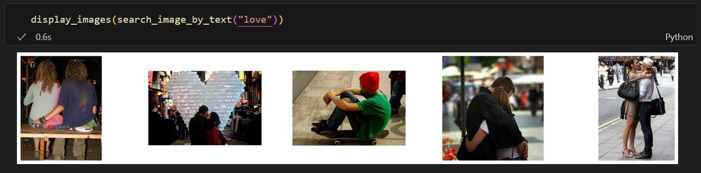

# 基于视觉语言大模型的零样本图像文本检索

CLIP论文：https://arxiv.org/abs/2103.00020

## 模型结构


双流视觉语言模型，分为Text Encoder和Image Encoder，Text Encoder使用Transformer，将文本转换为一个向量表示，Image Encoder使用ResNet或者ViT将图像转换为一个向量表示，使用线性映射层将文本表示和图像表示映射到公共嵌入空间。

## 训练方法


采用对比损失，通过文本和图像在公共嵌入空间的相似度判断文本和图像是否匹配。损失分为两部分，文本检索图像的CrossEntropyLoss（对于每个文本，判断哪个图像和它匹配）和图像检索文本的CrossEntropyLoss（对于每个图像，判断哪个文本和它匹配），两部分损失取平均作为最终损失，同时对Text Encoder和Image Encoder进行优化。

数据集选用网页爬取的文本图像对和现有的数据集如YFCC100M。

## 模型机理

模型为了能够正确完成图像文本匹配任务，需要将图像和与之配对的文本在公共嵌入空间上映射到相近的位置，从而实现图像和文本的跨模态对齐。论文中提到对比损失相比于生成损失（预测与图像匹配的文本的内容）更加高效。

## 零样本迁移

在使用预训练的CLIP做图像分类任务时，可以构造prompt，比如`A photo of {class}`，将图片映射到公共嵌入空间，各个类别的prompt也映射到公共嵌入空间，然后计算图片和各个类别prompt的相似度，取相似度最大的作为图片的类别。

在使用预训练的CLIP做图像文本检索任务时，可以将图片和文本使用CLIP进行编码，基于图像和文本的编码进行图像文本检索。

## 论文复现

由于CLIP训练需要大量数据和计算资源，论文中提到使用ViT的CLIP需要用256块V100训练12天。我使用预训练的CLIP验证其在Filker30K测试集上的性能。

我选择的预训练模型是Huggingface的[clip-vit-large-patch14](https://huggingface.co/openai/clip-vit-large-patch14)。

### 加载预训练模型

使用Huggingface的CLIP模型非常简单，使用CLIPModel.from_pretrained加载模型，并使用CLIPProcessor创建一个输入处理器。

```python
model = CLIPModel.from_pretrained("openai/clip-vit-large-patch14").to(DEVICE)
model.eval()
processor = CLIPProcessor.from_pretrained("openai/clip-vit-large-patch14")
```

### 模型推理

Huggingface提供了非常方便使用的推理方式，通过调用`inputs = processor(text=captions, images=images, return_tensors="pt", padding=True)`，得到预处理好的输入，然后直接送入模型得到推理结果：`outputs = model(**inputs)`。outputs中的`logits_per_image`（对于每个image，和各个caption的相似度）和`logits_per_text`（对于每个caption，和各个image的相似度）可以用来做图像文本检索。

### 数据集加载

我使用Huggingface上的[flickr30k](https://huggingface.co/datasets/nlphuji/flickr30k)数据集，各个字段已经整理好，可以非常方便的使用。


### 计算图片检索和文本检索召回率

我借鉴之前VSRN代码中的计算召回率的方法，对于图像检索和文本检索分别统计R@1，R@5，R@10，代码如下：

```python
def image2text(logits_per_image):
  image_cnt = logits_per_image.shape[0]
  ranks = np.zeros(image_cnt)
  indices = torch.argsort(logits_per_image, dim=1, descending=True)
  for idx in range(image_cnt):
    rank = 1e20
    for i in range(5 * idx, 5 * idx + 5):
      tmp = torch.where(indices[idx] == i)[0][0]
      if tmp < rank:
        rank = tmp
    ranks[idx] = rank
  r1 = len(np.where(ranks < 1)[0])
  r5 = len(np.where(ranks < 5)[0])
  r10 = len(np.where(ranks < 10)[0])
  return r1, r5, r10
```

```python
def text2image(logits_per_text):
  text_cnt = logits_per_text.shape[0]
  ranks = np.zeros(text_cnt)
  indices = torch.argsort(logits_per_text, dim=1, descending=True)
  for idx in range(text_cnt):
    ranks[idx] = torch.where(indices[idx] == idx // 5)[0][0]
  r1 = len(np.where(ranks < 1)[0])
  r5 = len(np.where(ranks < 5)[0])
  r10 = len(np.where(ranks < 10)[0])
  return r1, r5, r10
```

### 结果复现

由于模型比较大，无法一次对测试集所有样本进行推理，可以采用分批的方式进行推理计算：

```python
for idx in tqdm(range(0, len(test_set), batch_size)):
  captions = test_set[idx : idx + batch_size]["caption"]
  captions = [caption[:max_len] for nested_caption in captions for caption in nested_caption]
  images = test_set[idx : idx + batch_size]["image"]
  inputs = processor(text=captions, images=images, return_tensors="pt", padding=True)
  inputs = {k: v.to(DEVICE) for k, v in inputs.items()}
  with torch.no_grad():
    outputs = model(**inputs)
  r1, r5, r10 = image2text(outputs.logits_per_image)
  i2t_r1 += r1
  i2t_r5 += r5
  i2t_r10 += r10
  r1, r5, r10 = text2image(outputs.logits_per_text)
  t2i_r1 += r1
  t2i_r5 += r5
  t2i_r10 += r10
```

最终在flickr30k测试集上图像文本检索的召回率如下：


|                                | R @ 1 | R @ 5 | R @ 10 |
| ------------------------------ | ----- | ----- | ------ |
| Image to Text (Text Retrieval) | 90.3  | 98.9  | 99.6   |
| Text to Image (ImageRetrieval) | 75.8  | 93.3  | 96.4   |


可以看到比论文中的结果要好一些。

## 检索测试

我使用[faiss](https://github.com/facebookresearch/faiss)构建向量数据库进行图片检索和文本检索。我将Flickr30k数据集中的所有文本和图片进行编码分别存储到各自的向量数据库中。

创建向量数据库：

```python
vector_dim = 768
image_index = faiss.IndexFlatIP(vector_dim)
text_index = faiss.IndexFlatIP(vector_dim)
```

将数据集中的图片和文本编码放入到各自的向量数据库中：

```python
for idx in tqdm(range(0, len(dataset), batch_size)):
  captions = dataset[idx : idx + batch_size]["caption"]
  captions = [caption[:max_len] for nested_caption in captions for caption in nested_caption]
  images = dataset[idx : idx + batch_size]["image"]
  inputs = processor(text=captions, images=images, return_tensors="pt", padding=True)
  inputs = {k: v.to(DEVICE) for k, v in inputs.items()}
  with torch.no_grad():
    outputs = model(**inputs)
  image_index.add(outputs.image_embeds.cpu().numpy())
  text_index.add(outputs.text_embeds.cpu().numpy())
```

文本编码方法和图像编码方法：

```python
def encode_text(text):
  inputs = processor(text=text, return_tensors="pt", padding=True).to(DEVICE)
  with torch.no_grad():
    text_outputs = model.text_model(**inputs)
    text_embeds = text_outputs[1]
    text_embeds = model.text_projection(text_embeds)
    text_embeds = text_embeds / text_embeds.norm(p=2, dim=-1, keepdim=True)
return text_embeds.cpu().numpy()
```

```python
def encode_image(image):
  inputs = processor(images=image, return_tensors="pt", padding=True).to(DEVICE)
  with torch.no_grad():
    vision_outputs = model.vision_model(**inputs)
    image_embeds = vision_outputs[1]
    image_embeds = model.visual_projection(image_embeds)
    image_embeds = image_embeds / image_embeds.norm(p=2, dim=-1, keepdim=True)
return image_embeds.cpu().numpy()
```

文本检索图像：

```python
def search_image_by_text(text, k=5):
  text_embeds = encode_text(text)
  _, indices = image_index.search(text_embeds, k)
  return dataset[indices[0]]['image']
```

图像检索文本：

```python
def search_text_by_image(image_path, k=5):
  image = Image.open(image_path)
  image_embeds = encode_image(image)
  _, indices = image_index.search(image_embeds, k)
  return dataset[indices[0]]['caption']
```

**文本检索图像效果测试：**




可以看到，文本不仅能有效检索包含具体物体（如car、people、street）的图像，而且还能检索出反映抽象概念（如having fun、love）的图像。

**图像检索文本效果测试：**

我使用一张网络上的图片（不在数据集中）进行文本检索。尽管这些文本原本是用来描述数据集中的图片的，与该图片内容并不完全一致，但检索到的文本描述还是与图片内容有许多相似之处。比如：`A woman in blue dress in crossing the street while a person in bright yellow is riding their bike down it.`。


以下是这张图片文本检索的Top 5结果（每个结果包含5个caption）：

```
[['A woman in blue dress in crossing the street while a person in bright yellow is riding their bike down it.',
  'A woman in a blue and white polka dotted dress is crossing the street in a busy city.',
  'A city street scene with the backs of a woman crossing the street and a bicyclist.',
  'A busy women in black and white color dress is crossing the road.',
  'Pedestrians busy walking and shopping.'],
 ['Several people, one being a woman in a black dress, are outside, near a bike rack.',
  'A man chains his bike to a rack while a woman in black and red walks.',
  'Woman in black dress with red accessories is walking down the street.',
  'The woman wearing a red bow walks past a bicycle.',
  'Woman in a black dress walking on the street.'],
 ['A woman reading while sitting on a bench as traffic passes on the street behind her.',
  'A woman sits on a park bench as a scooter, car and bus drive by behind her.',
  'A city street with a metal bench occupied by a woman in black.',
  'A woman is sitting on a bench in front of a road, reading.',
  'A blond woman sitting on a bench writing.'],
 ['A woman cyclist in a shirt wearing a bike helmet waits with a child passenger at a stop with another woman cyclist wearing a blue shirt and black pants.',
  'Two people riding bicycles are stopped along with cars at an intersection after crossing the bridge in front of Marriott.',
  'Two bicyclists stop beside motor traffic at an intersection.',
  'Two people are riding their bikes in city traffic.',
  'Two women await a traffic light at the crosswalk.'],
 ['A city street has parked cards on one side of it and there are people walking in the street, as well as people walking on the sidewalk.',
  'People are walking down a narrow street that is lined with cars.',
  'Seven vehicles parked on one side of a small street.',
  'Birds eye view of a one lane street in the city.',
  'People walking on a one way urban street.']]
```
