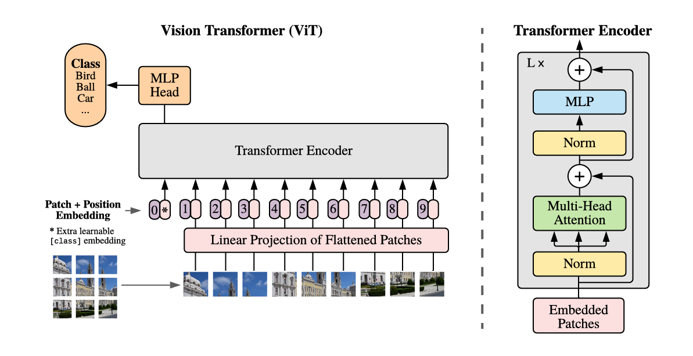
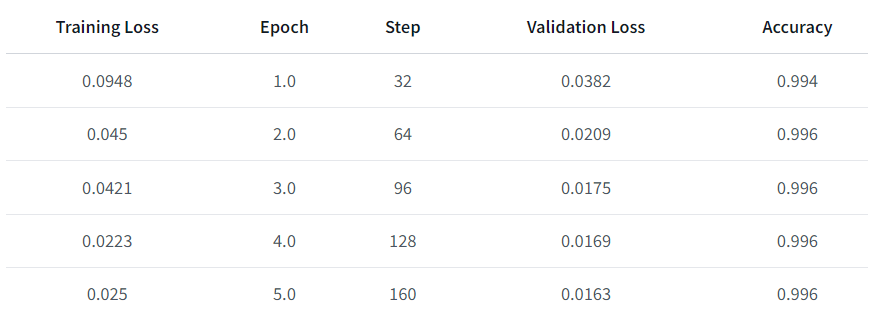
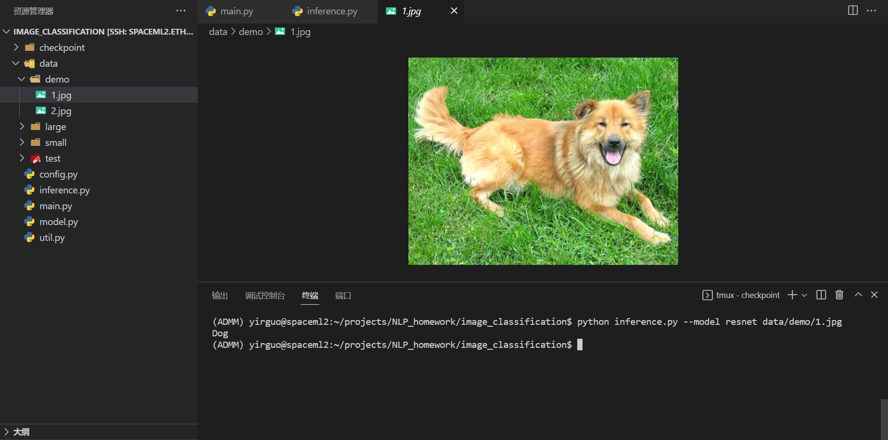
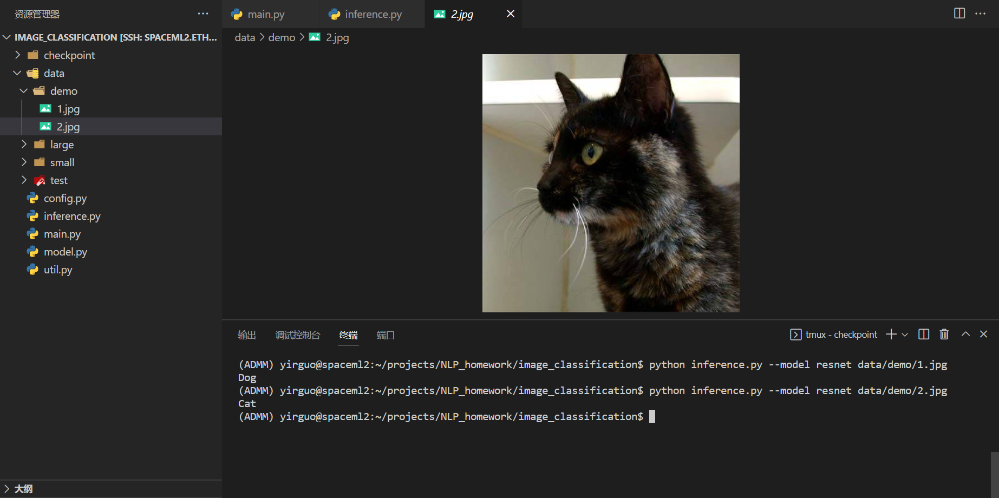
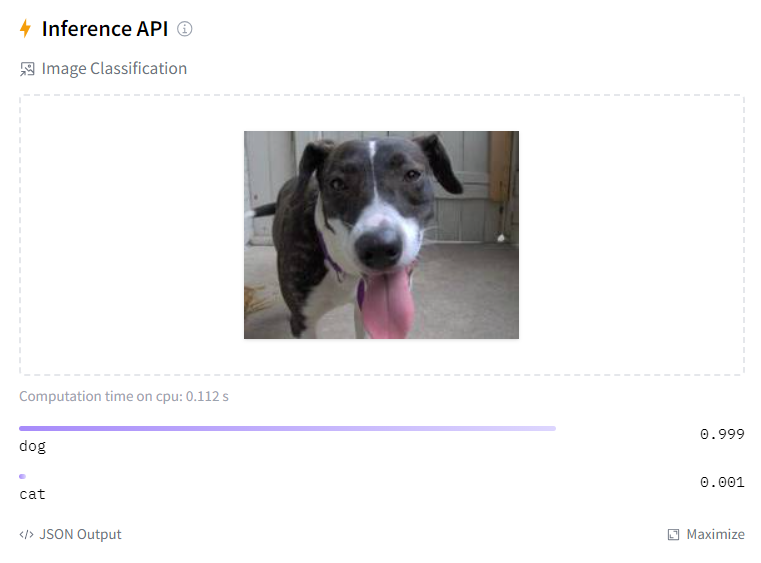
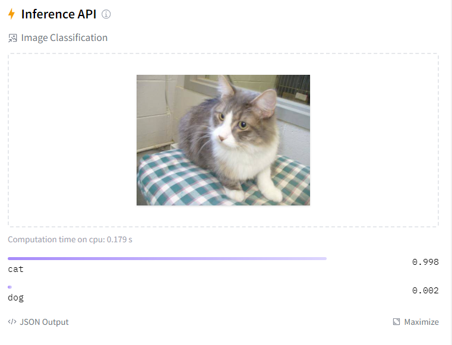

# 作业一：基于深度神经网络的猫狗图像分类

## 数据预处理

原始数据集格式为train和val文件夹下，各个图片以类别名.序号命名。为了便于使用PyTorch的datasets.ImageFolder构建数据集，将猫的图片放入cat目录，狗的图片放入dog目录。代码如下：

```python
def move_images_to_folders(data_dir, classes):
    for class_name in classes:
        class_dir = os.path.join(data_dir, class_name)
        if not os.path.exists(class_dir):
            os.makedirs(class_dir)

        for img_file in os.listdir(data_dir):
            if img_file.startswith(class_name):
                shutil.move(os.path.join(data_dir, img_file), class_dir)

                
if __name__ == "__main__":
    move_images_to_folders("data/small/train", ["cat", "dog"])
    move_images_to_folders("data/small/val", ["cat", "dog"])
```

## 构建数据加载器

图片是彩色的，而且各个图片的尺寸不相同，需要定义一组变换，将图片转换为模型易于处理的tensor。

我使用的变换如下：

```python
image_transforms = {
    "train": transforms.Compose(
        [
            transforms.RandomResizedCrop(224),
            transforms.RandomHorizontalFlip(),
            transforms.ToTensor(),
            transforms.Normalize([0.485, 0.456, 0.406], [0.229, 0.224, 0.225]),
        ]
    ),
    "val": transforms.Compose(
        [
            transforms.Resize(256),
            transforms.CenterCrop(224),
            transforms.ToTensor(),
            transforms.Normalize([0.485, 0.456, 0.406], [0.229, 0.224, 0.225]),
        ]
    ),
}
```

即在训练集上，将图片随机裁剪缩放为224 * 224的固定大小 => 随机水平翻转（数据增强）=> 转换为tensor => 归一化。在验证集上，不需要引入数据增强，只做尺寸调整和归一化。

随后即可定义数据加载器：

```python
train_dataset = datasets.ImageFolder(
    root=os.path.join(config.data_path, "train"),
    transform=image_transforms["train"],
)
train_loader = torch.utils.data.DataLoader(
    train_dataset, batch_size=config.batch_size, shuffle=True, num_workers=16
)

val_dataset = datasets.ImageFolder(
    root=os.path.join(config.data_path, "val"), transform=image_transforms["val"]
)
val_loader = torch.utils.data.DataLoader(
    val_dataset, batch_size=config.batch_size, shuffle=False, num_workers=16
)
```

## 定义损失函数和优化器

损失函数使用交叉熵损失函数，优化器使用Adam。

```python
criterion = nn.CrossEntropyLoss()
optimizer = torch.optim.Adam(model.parameters(), lr=config.lr)
```

## 定义训练函数和验证函数

```python
def train_epoch(model, criterion, optimizer, dataloader, clip, device):
    model.train()
    running_loss = 0.0
    running_corrects = 0

    for inputs, labels in tqdm(dataloader, desc="Training: ", leave=False):
        if isinstance(model, BiRNN):
            # 原始的图像形状为: [N, 3, 224, 224]
            # 需要将其变为: [N, 224, 3*224]
            batch_size = inputs.size(0)
            inputs = inputs.permute(0, 2, 1, 3)
            inputs = inputs.reshape(batch_size, 224, -1)
        inputs, labels = inputs.to(device), labels.to(device)
        optimizer.zero_grad()
        with torch.set_grad_enabled(True):
            outputs = model(inputs)
            preds = torch.argmax(outputs, dim=1)
            loss = criterion(outputs, labels)
            loss.backward()
            torch.nn.utils.clip_grad_norm_(model.parameters(), clip)
            optimizer.step()
        running_loss += loss.item() * inputs.size(0)
        running_corrects += torch.sum(preds == labels)

    epoch_loss = running_loss / len(dataloader.dataset)
    epoch_acc = running_corrects.double() * 100 / len(dataloader.dataset)

    return epoch_loss, epoch_acc
```

```python
def val_epoch(model, criterion, dataloader, device):
    model.eval()
    running_loss = 0.0
    running_corrects = 0
    precision_metric = MulticlassPrecision(average=None, num_classes=2).to(device)
    recall_metric = MulticlassRecall(average=None, num_classes=2).to(device)

    for inputs, labels in tqdm(dataloader, desc="Evaluating: ", leave=False):
        if isinstance(model, BiRNN):
            # 原始的图像形状为: [N, 3, 224, 224]
            # 需要将其变为: [N, 224, 3*224]
            batch_size = inputs.size(0)
            inputs = inputs.permute(0, 2, 1, 3)
            inputs = inputs.reshape(batch_size, 224, -1)
        inputs, labels = inputs.to(device), labels.to(device)

        with torch.set_grad_enabled(False):
            outputs = model(inputs)
            preds = torch.argmax(outputs, dim=1)
            loss = criterion(outputs, labels)

        precision_metric.update(preds, labels)
        recall_metric.update(preds, labels)
        running_loss += loss.item() * inputs.size(0)
        running_corrects += torch.sum(preds == labels)

    epoch_loss = running_loss / len(dataloader.dataset)
    epoch_acc = running_corrects.double() * 100 / len(dataloader.dataset)
    precision = precision_metric.compute()
    recall = recall_metric.compute()

    return epoch_loss, epoch_acc, precision, recall
```

## 定义模型

有了以上这些步骤后，将模型、损失函数、优化器、数据加载器传入训练函数和验证函数即可进行模型训练和验证。下面主要介绍不同模型的定义。

### DNN

DNN比较简单，将图片拍成一维向量传入一个MLP即可。由于参数数量巨大，很容易过拟合，因此引入dropout减少模型过拟合。

模型定义如下：

```python
class DNN(nn.Module):
    def __init__(self):
        super(DNN, self).__init__()
        self.layer1 = nn.Linear(224 * 224 * 3, 256)
        self.dropout1 = nn.Dropout(0.5)
        self.layer2 = nn.Linear(256, 128)
        self.dropout2 = nn.Dropout()
        self.layer3 = nn.Linear(128, 2)

    def forward(self, x):
        x = x.view(x.size(0), -1)
        x = F.relu(self.layer1(x))
        x = self.dropout1(x)
        x = F.relu(self.layer2(x))
        x = self.dropout2(x)
        x = F.relu(self.layer3(x))
        return x
```

使用三层，第一次层256个神经元，第二层128个神经元，第三层2个神经元。

### CNN

CNN网络结构定义很灵活，我使用了三种网络结构。

#### CNN结构一：LeNet

```python
class LeNet(nn.Module):
    def __init__(self, num_classes=2):
        super(LeNet, self).__init__()
        self.conv1 = nn.Conv2d(3, 6, 5)
        self.pool = nn.MaxPool2d(2, 2)
        self.conv2 = nn.Conv2d(6, 16, 5)
        self.fc1 = nn.Linear(16 * 53 * 53, 120)
        self.fc2 = nn.Linear(120, 84)
        self.fc3 = nn.Linear(84, num_classes)

    def forward(self, x):
        x = self.pool(F.relu(self.conv1(x)))
        x = self.pool(F.relu(self.conv2(x)))
        x = x.view(-1, 16 * 53 * 53)
        x = F.relu(self.fc1(x))
        x = F.relu(self.fc2(x))
        x = self.fc3(x)
        return x
```

先使用6个5*5的卷积核进行卷积，然后通过2\*2的最大池化层，再通过16个5\*5的卷积核进行卷积，再通过2\*2的最大池化层，将得到的特征图拉成一维向量过三个全连接层。tensor形状大小变换如下：

224 * 224 * 3 => 220 * 220 * 6 => 110 * 110 * 6 => 106 * 106 * 16 => 53 * 53 * 16 => 120 => 84 => 2

#### CNN结构二：VGG16

```python
class VGG16(nn.Module):
    def __init__(self, num_classes=2):
        super(VGG16, self).__init__()
        # 定义五个卷积块，包括卷积层和池化层
        self.features = nn.Sequential(
            # Block 1
            nn.Conv2d(3, 64, kernel_size=3, padding=1),
            nn.ReLU(inplace=True),
            nn.Conv2d(64, 64, kernel_size=3, padding=1),
            nn.ReLU(inplace=True),
            nn.MaxPool2d(kernel_size=2, stride=2),
            
            # Block 2
            nn.Conv2d(64, 128, kernel_size=3, padding=1),
            nn.ReLU(inplace=True),
            nn.Conv2d(128, 128, kernel_size=3, padding=1),
            nn.ReLU(inplace=True),
            nn.MaxPool2d(kernel_size=2, stride=2),
            
            # Block 3
            nn.Conv2d(128, 256, kernel_size=3, padding=1),
            nn.ReLU(inplace=True),
            nn.Conv2d(256, 256, kernel_size=3, padding=1),
            nn.ReLU(inplace=True),
            nn.Conv2d(256, 256, kernel_size=3, padding=1),
            nn.ReLU(inplace=True),
            nn.MaxPool2d(kernel_size=2, stride=2),
            
            # Block 4
            nn.Conv2d(256, 512, kernel_size=3, padding=1),
            nn.ReLU(inplace=True),
            nn.Conv2d(512, 512, kernel_size=3, padding=1),
            nn.ReLU(inplace=True),
            nn.Conv2d(512, 512, kernel_size=3, padding=1),
            nn.ReLU(inplace=True),
            nn.MaxPool2d(kernel_size=2, stride=2),
            
            # Block 5
            nn.Conv2d(512, 512, kernel_size=3, padding=1),
            nn.ReLU(inplace=True),
            nn.Conv2d(512, 512, kernel_size=3, padding=1),
            nn.ReLU(inplace=True),
            nn.Conv2d(512, 512, kernel_size=3, padding=1),
            nn.ReLU(inplace=True),
            nn.MaxPool2d(kernel_size=2, stride=2),
        )

        # 定义三个全连接层
        self.classifier = nn.Sequential(
            nn.Linear(512 * 7 * 7, 512),
            nn.ReLU(inplace=True),
            nn.Dropout(),
            nn.Linear(512, 128),
            nn.ReLU(inplace=True),
            nn.Dropout(),
            nn.Linear(128, num_classes),
        )

    def forward(self, x):
        x = self.features(x)
        x = x.view(x.size(0), -1)
        x = self.classifier(x)
        return x

```


VGG-16结构整齐，都是用3*3的卷积核(padding=1，不改变图像的长和宽)和2\*2的池化层，基本遵循长宽减半通道数翻倍的规律。tensor形状大小变换如下：

224 \* 224 \* 3 => 224 * 224 * 64 => 224 * 224 * 64 => 112 * 112 * 64 => 112 * 112 * 128 => 112 * 112 * 128 => 56 * 56 * 128 => 56 * 56 * 256 => 56 * 56 * 256 => 56 * 56 * 256 => 28 * 28 * 256 => 28 * 28 * 512 => 28 * 28 * 512 => 28 * 28 * 512 => 14 * 14 * 512 => 14 * 14 * 512 => 14 * 14 * 512 => 14 * 14 * 512 => 7 * 7 * 512 => 512 => 128 => 2

总共13个卷积层 + 3个全连接层。

#### CNN结构三：ResetNet18

使用预训练的resnet18，改变最后一层全连接层，使其输出2维向量。在训练时只训练最后一层。

```python
model = models.resnet18(weights=models.ResNet18_Weights.DEFAULT)
for param in model.parameters():
    param.requires_grad = False
num_features = model.fc.in_features
model.fc = nn.Linear(num_features, 2)
```

### RNN

我使用多层双向LSTM模型

```python
class BiRNN(nn.Module):
    def __init__(
        self,
        input_size=224 * 3,
        hidden_size=256,
        num_layers=4,
        num_classes=2,
    ):
        super(BiRNN, self).__init__()
        self.hidden_size = hidden_size
        self.num_layers = num_layers
        self.lstm = nn.LSTM(
            input_size, hidden_size, num_layers, batch_first=True, bidirectional=True
        )
        self.fc = nn.Linear(hidden_size * 2, num_classes)
        self.dropout = nn.Dropout()

    def forward(self, x):
        h0 = torch.zeros(self.num_layers * 2, x.size(0), self.hidden_size).to(x.device)
        c0 = torch.zeros(self.num_layers * 2, x.size(0), self.hidden_size).to(x.device)
        out, _ = self.lstm(x, (h0, c0))
        out = self.dropout(out)
        out = self.fc(out[:, -1, :])
        return out
```

使用RNN进行图像分类的思想是：将图像的宽（高）看成一个序列，每个时间步输入当前列（行）的像素（如果是多通道，将各个通道拼接在一起）。将最后一层最后一个时间步的输出作为整个图像的特征，过一个MLP得到最后的分类结果。

我设置隐状态大小为256，4层，双向。最后过一个2个神经元的全连接层。

### ViT

将图片分成一个个固定大小的patch，每个patch拍成一个向量，使用一个线性层进行编码，再加上位置编码。得到的向量序列（类似于NLP中的token序列）送入一个标准的Transformer编码器中。在序列的头部加入一个额外的可学习的分类token，该token最后一层的输出过一个分类头得到图像的分类。



## 模型训练和验证

```python
batch_size = 512
lr = 0.001
clip = 1
epochs = 50
```

批大小设置为512，学习率设置为0.001，梯度裁剪设置为1，每种模型训练50个epoch。

使用6张NVIDIA TITAN Xp在全量数据集上进行训练。（ResNet18由于属于fine-tune，仅在小数据集上训练）

保存验证集上正确率最高的模型：

```python
best_valid_acc = 0.0
for epoch in range(config.epochs):
    train_loss, train_acc = train_epoch(
        model, criterion, optimizer, train_loader, config.clip, DEVICE
    )
    val_loss, val_acc, _, _ = val_epoch(model, criterion, val_loader, DEVICE)
    lr_scheduler.step(val_loss)
    if val_acc > best_valid_acc:
        best_valid_acc = val_acc
        torch.save(model, f"checkpoint/{config.model}.pt")
```

对于ViT的训练，我使用Hugging Face提供的用于图像分类任务的示例脚本（ https://github.com/huggingface/transformers/blob/main/examples/pytorch/image-classification/run_image_classification.py ），使用**vit-base-patch16-224**预训练模型，在小数据集上训练5个Epoch，训练参数如下：

```sh
python run_image_classification.py \
    --model_name_or_path google/vit-base-patch16-224 \
    --train_dir ./data/train \
    --validation_dir ./data/val \
    --output_dir ./outputs \
    --remove_unused_columns False \
    --do_train \
    --do_eval \
    --push_to_hub \
    --push_to_hub_model_id vit-base-cat_or_dog \
    --learning_rate 2e-5 \
    --num_train_epochs 5 \
    --per_device_train_batch_size 8 \
    --per_device_eval_batch_size 8 \
    --logging_strategy steps \
    --logging_steps 10 \
    --evaluation_strategy epoch \
    --save_strategy epoch \
    --load_best_model_at_end True \
    --save_total_limit 3 \
    --seed 1337 \
    --ignore_mismatched_sizes \
    --cache_dir ./cache
```

训练过程记录如下：



训练好的模型请见：https://huggingface.co/gyr66/vit-base-cat_or_dog 。

## 实验结果

各个模型验证集最高正确率如下表所示：

| 模型                       | 可训练参数大小 | 验证集正确率 |
| -------------------------- | -------------- | ------------ |
| VGG16(CNN)                 | 27,626,178     | **97.60%**   |
| LeNet(CNN)                 | 5,406,606      | **88.00%**   |
| ResNet18(CNN)（fine-tune） | 1,026          | **99.20%**   |
| Bi-LSTM(RNN)               | 6,636,546      | **75.60%**   |
| DNN                        | 38,568,578     | **50.20%**   |
| ViT-base（fine-tune）           | 85,800,194     | **99.60%**   |

准确率和召回率

| 模型                       | 准确率（猫）（预测是猫的有多少比例实际是猫） | 召回率（猫）（多少比例的猫被模型识别出来） | 准确率（狗）（预测是狗的有多少比例实际是狗） | 召回率（狗）（多少比例的狗被模型识别出来） |
| -------------------------- | -------------------------------------------- | ------------------------------------------ | -------------------------------------------- | ------------------------------------------ |
| VGG16(CNN)                 | 0.98                                         | 0.98                                       | 0.98                                         | 0.98                                       |
| LeNet(CNN)                 | 0.87                                         | 0.90                                       | 0.90                                         | 0.86                                       |
| ResNet18(CNN)（fine-tune） | 0.99                                         | 0.99                                       | 0.99                                         | 0.99                                       |
| Bi-LSTM(RNN)               | 0.77                                         | 0.73                                       | 0.74                                         | 0.78                                       |
| DNN                        | 0.50                                         | 1.00                                       | 1.00                                         | 0.00                                       |
| ViT-base（fine-tune）           | 0.99                                         | 1.00                                       | 1.00                                         | 0.99                                       |

## 模型大小对比

| 模型                       | 大小  |
| -------------------------- | ----- |
| VGG16(CNN)                 | 106MB |
| LeNet(CNN)                 | 21MB  |
| ResNet18(CNN)（fine-tune） | 43MB  |
| Bi-LSTM(RNN)               | 26MB  |
| DNN                        | 148MB |
| ViT-base（fine-tune）           | 328MB |

## 推理

使用torch.load加载预训练的模型，将图片大小调整为224 * 224，转换为tensor，再归一化，送入到模型中，得到推理结果。

```python
def inference(model, image_path, device):
    transform = transforms.Compose(
        [
            transforms.Resize((224, 224)),
            transforms.ToTensor(),
            transforms.Normalize(mean=[0.485, 0.456, 0.406], std=[0.229, 0.224, 0.225]),
        ]
    )
    model = model.to(device)
    model.eval()
    img_tensor = load_image(image_path, transform)
    img_tensor = img_tensor.to(device)
    outputs = model(img_tensor)
    class_id = torch.argmax(outputs.data, 1)
    return class_id.item()
```





对于ViT的推理，可以使用Hugging Face的Inference API：





​		