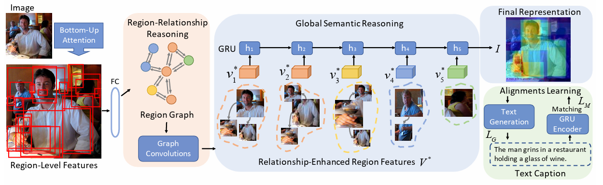
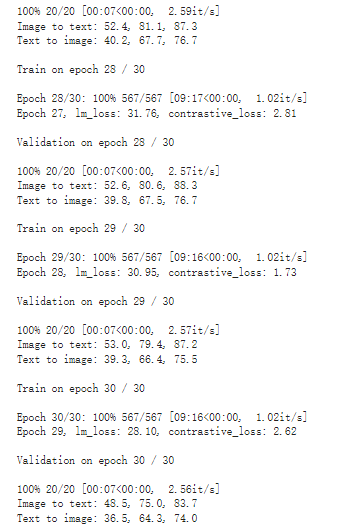
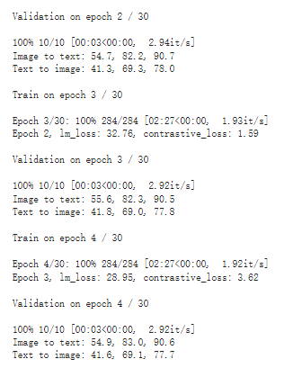
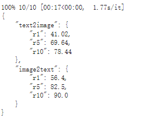
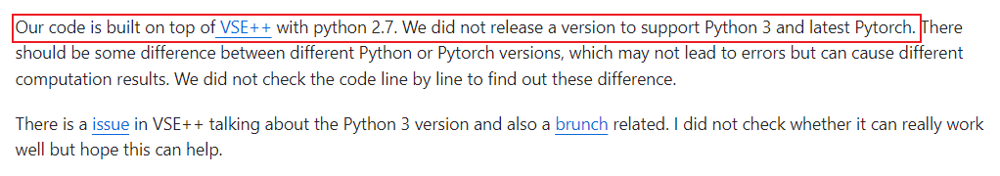
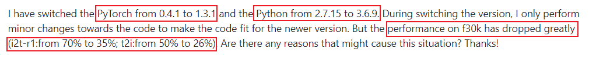

# 作业二：基于深度神经网络的图像检索

复现论文：https://openaccess.thecvf.com/content_ICCV_2019/html/Li_Visual_Semantic_Reasoning_for_Image-Text_Matching_ICCV_2019_paper.html

## 模型结构

### 图像表征

使用在Visual Genomes数据集上预训练好的以ResNet-101作为主干网的Faster RCNN对图像提取ROI特征，选分数最高的36个ROI作为图像表征。对于每个图像特征，shape为(36, 2048)。在训练模型和验证模型时，直接使用预处理好的图像特征。

### 文本表征

使用GRU对文本进行编码，使用最后一层的最后一个隐状态作为文本的表征。

### 局部关系推理

使用图神经网络将区域特征进行融合。

使用区域特征计算区域关系矩阵，从而得到全连接图。区域关系矩阵计算方式如下：
$$
R(v_i, v_j) = \phi(v_i)^T \psi(v_j) \\
\phi(v_i) = W_{\phi} v_i \\
\psi(v_j) = W_{\psi} v_j
$$
使用特征变换矩阵对每个区域的特征进行变换，再利用区域关系矩阵将邻居节点和自身进行特征融合。

论文中还加入了残差连接矩阵。图神经网络的实现公式如下：
$$
V^* = W_r(RVW_g) + V
$$

### 全局关系推理

为了得到整个图的特征表示，论文在使用区域关系推理融合后的特征表示上又使用了RNN进行全局特征提取。

将融合后的区域表征送入RNN，取最后一层的最后一个时间步的隐状态作为图的全局特征表示。

### 训练目标

论文使用了两个训练损失：对比损失和文本生成损失。

对比损失，训练模型使得匹配的图像表征和文本表征在向量空间近，不匹配的图像表征和文本表征在向量空间远。损失函数定义如下：
$$
L_M = [\alpha - S(I, C) + S(I, \hat{C})]_+ + [\alpha - S(I, C) + S(I, \hat{C})]_+
$$
文本生成损失，让模型根据区域特征生成图片对应的文本描述。指导模型关注图像中的重要信息而忽略不重要的信息。损失函数定义如下：
$$
L_G = -\sum_{t=1}^{l} \log p(y_t | y_{t-1}, V^*; \theta)
$$
两个损失相加作为总损失训练模型：
$$
L = L_M + L_G
$$


## 模型机理

模型使用对比损失使得图像编码和文本编码在向量空间对齐，另外使用文本生成损失指导模型关注图像中的主要信息忽视不重要的信息。

为了表示图像中不同区域之间的关系，使用图神经网络将不同区域的特征进行融合（局部推理）。为了形成全局表示，在融合后的区域表示上再使用GRU做全局推理，最终形成图像的整体表示。

## 模型复现

参考代码：https://github.com/KunpengLi1994/VSRN

我仔细阅读了作者的实现代码，在此基础上对代码进行重构和重新组织，使得代码结构更加清晰，一些地方的实现更加简洁。完整复现代码请见code文件夹。

### 模型定义

VSRN模型可以拆分为image_encoder、caption_encoder、caption_generator。

image_encoder使用GCN、GRU；

caption_encoder使用GRU；

caption_generator是一个带有注意力的Encoder-Decoder，使用Attention，GRU。

模型定义请见：models文件夹下的各个模块定义。

### 数据集定义

我使用作者提供的预处理好的图像特征和词表。

数据处理时主要将文本变成token，同时使用collate_fn将一个批次中的样本填充到相同长度，方便RNN处理。

数据集定义请见：data.py。

### 模型训练

语言模型的损失函数和对比损失函数请见：loss.py。

训练过程核心代码如下：

```python
def train_epoch(
    epoch, config, dataloader, model, optimizer, lm_loss_fn, contrastive_loss_fn
):
    model.train()
    for train_data in tqdm(
        dataloader, total=len(dataloader), desc=f"Epoch {epoch+1}/{config.epochs}"
    ):
        images, captions, masks, valid_length, _ = train_data
        images = images.to(config.device)
        captions = captions.to(config.device)
        masks = masks.to(config.device)

        img_feats, caption_feats, caption_generator_ouput = model(
            images, captions, valid_length
        )

        lm_loss = lm_loss_fn(caption_generator_ouput, captions[:, 1:], masks[:, 1:])
        contrastive_loss = contrastive_loss_fn(img_feats, caption_feats)
        loss = lm_loss + contrastive_loss
        optimizer.zero_grad()
        loss.backward()
        optimizer.step()

    return lm_loss.item(), contrastive_loss.item()
```

### 模型评估

借鉴官方评估的实现，计算测试集上每个图片和文本的特征，然后通过相似度进行匹配。统计r1、r5和r10。

评估脚本请见：evaluate.py。

## 复现结果

由于数据集比较大，而且我本地没有比较好的GPU进行训练，我选择使用colab挂载google drive进行模型训练。

我使用colab的V100 GPU进行训练，batch_size = 256，lr = 2e-4，训练30个Epoch，在验证集上的表现如下：



随后我又将学习率设置为1e-5，又训练了若干Epoch：



选取最好的模型，在测试集上表现如下：



| Fliker30K         | R@1   | R@5   | R@10  |
| ----------------- | ----- | ----- | ----- |
| Caption Retrieval | 56.4  | 82.5  | 90.0  |
| Image Retrieval   | 41.02 | 69.64 | 78.44 |

可以看到比论文中的结果差很多。

我在github issue（ https://github.com/KunpengLi1994/VSRN/issues/15 ）中看到作者说他们是使用Python 2.7实现的，并不支持Python 3和最新的PyTorch：



并且有人说从Python 2切换到Python 3以及PyTorch 1.3.1后在f30k性能大幅下降：



另外我的实现和论文作者的实现不完全相同，比如在计算语言模型损失时，作者先计算log_prob再计算NLLLoss，我直接在logits上计算CrossEntropyLoss，还有一些细节上的修改，我认为这些改动不会影响性能。

colab中只有Python 3的环境，因此我没法使用Python 2运行代码。我感觉性能上的差距可能和PyTorch版本有关，在之前版本上的超参数可能在新版PyTorch中并不是最优的。因此可能是由于超参数的影响导致性能和论文中的结果有差距。

## 问题与解决

在复现模型时遇到了两个问题一直导致复现结果不好：

1. 在定义GCN Block时，没有将残差连接矩阵初始化为0。

   ```python
   nn.init.constant_(self.W[1].weight, 0)
   nn.init.constant_(self.W[1].bias, 0)
   ```

2. 在模型评估时，由于在collate_fn将批次中的样本按照长度从大到小排序（为了能够传递给torch.nn.utils.rnn.pack_padded_sequence），在评估时得到编码的顺序和原始数据集的顺序不一致，导致评估错误。我一直以为是模型实现的问题，花了很长时间进行debug。